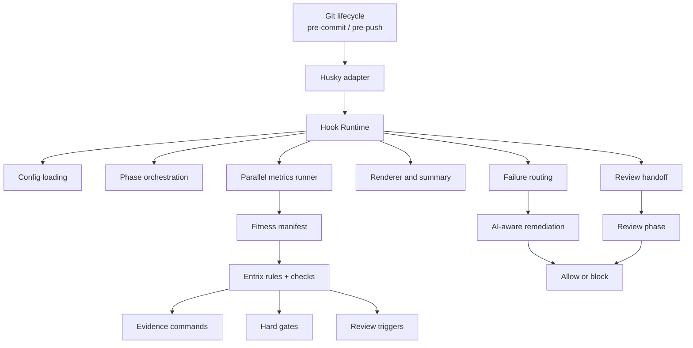
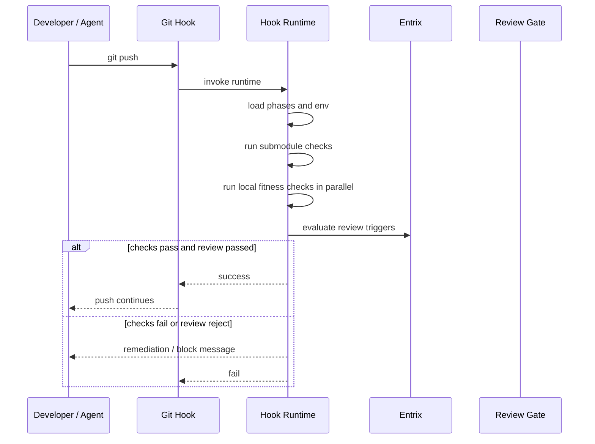

# Routa Hook Runtime

Routa Hook Runtime 是 Routa 在开发者本地执行的一层 **Git Hook 运行时**。  
它把本地检查、Fitness Gate、Review Trigger 与 AI-aware 失败处理接入 `pre-commit`、`pre-push` 等 Git 生命周期，并以统一、可并行、可扩展的方式执行。

> Entrix 定义 Gate，Hook Runtime 在开发者机器上执行 Gate。

## 快速定位

在当前仓库中，Hook Runtime 落在：

- `tools/hook-runtime/src/cli.ts`（CLI 入口）
- `tools/hook-runtime/src/fitness.ts`（指标执行）
- `tools/hook-runtime/src/metrics.ts`（指标清单加载与分辨率）
- `tools/hook-runtime/src/scheduler.ts`（并行调度与 fail-fast）
- `tools/hook-runtime/src/renderer.ts`（人类/机器可读输出渲染）
- `tools/hook-runtime/src/review.ts`（review trigger 与放行策略）
- `tools/hook-runtime/src/check-submodule-refs.ts`（submodule 预检）
- `tools/hook-runtime/src/process.ts`（子进程执行与输出管理）
- `tools/hook-runtime/src/prompt.ts`（交互提示）
- `tools/hook-runtime/src/ai.ts`（AI 环境探测）

对应的入口脚本是 Husky `pre-push` Hook（当前实现以推送流程为主，CLI 可按阶段扩展）。

## Positioning

### A local gate runtime

它是开发者机器上的执行层，用于在代码进入远端仓库前前移反馈。

### A hook orchestrator

它不是只执行单条命令，而是组织 phase、调度并行 jobs、渲染结果、处理失败与 review handoff。

### Not a policy engine

它不定义 Fitness 规则本身；metrics、threshold、hard gate、review trigger 的治理语义由 Entrix 与 `docs/fitness` 维护。

因此可以用“实现名 / 架构角色名”对齐口径：

- 实现名：`Routa Hook Runtime`
- 架构角色名：`Local Fitness Gate Runtime`
- 策略系统：`Entrix`

## Relationship with Entrix

### Entrix（Policy）

Entrix 作为 **Fitness / Evidence Engine**：

- 定义并执行 metric、hard gate、threshold
- 定义 evidence commands
- 定义 review triggers

它回答：什么算通过？什么必须阻断？什么要进入 review？

### Hook Runtime（Execution）

Hook Runtime 负责：

- 接入 Git 生命周期（pre-commit / pre-push）
- 加载本地配置与指标
- 并行执行 checks
- 汇总并渲染结果
- 失败分流与 remediation handoff
- 在需要时触发 review phase

它回答：在本地提交和推送时这些检查如何执行？

## Architecture



## Execution lifecycle（当前实现）



## Responsibilities

1. Git 生命周期接入
   - 统一入口（由 husky 或其他触发器调用），避免散落式脚本。
2. 阶段编排
   - 目前包含：`submodule`、`fitness`、`review` 阶段。
3. 并行执行
   - 同阶层可独立指标并发，支持 `jobs` 限流。
4. 输出渲染
   - 人类可读日志（human）
   - JSONL 事件流（machine-readable）
5. 失败路由
   - fail-fast 控制
   - 失败摘要输出
   - AI 环境下直接报错退出
   - 非 AI 环境支持 Claude 自动修复提示流程（可选）
6. Review handoff
   - 通过 review trigger 阶段决定继续或阻断，保持可复用的决策抽象。

## Non-goals

- 不定义 policy（不在运行时里内嵌规则）
- 不替代 CI（CI 负责完整、可审计的远端校验）
- 不是 shell 脚本堆叠层

## Design principles

- Thin hooks, rich runtime（Hook 文件保持薄层，运行时承载能力）
- Policy out of scripts（策略外置，避免硬编码）
- Parallel by default（独立检查优先并行）
- Human- and agent-aware（同时支持人和 agent 的消费）
- Review as first-class phase（以 review 作为一等流程分支）

## Features（实现与承诺）

当前已支持：

- 统一 CLI 入口（本地 hook）
- 阶段化执行（submodule / fitness / review）
- 并行指标执行（可配置并发）
- 结构化事件输出（`jsonl`）
- fail-fast 与失败聚合摘要
- review handoff

未来会补齐：

- 更完整的 hook-name 路由（pre-commit / pre-push）
- plugin/phase 扩展模型
- 更稳定的外部可复用 API（非 Hook 命令入口）

## Directory structure（建议）

```text
tools/
  hook-runtime/
    README.md
    package.json
    src/
      cli.ts
      config.ts
      metrics.ts
      review.ts
      renderer.ts
      scheduler.ts
      fitness.ts
      process.ts
      ai.ts
      prompt.ts
      check-submodule-refs.ts
      check-markdown-links.ts
      check-schedules-db.ts
      typecheck-smart.ts
```

## CLI（当前）

`hook-runtime` 当前行为为当前仓库内的 pre-push runtime，示例：

```bash
pnpm exec tsx tools/hook-runtime/src/cli.ts --jobs 4
pnpm exec tsx tools/hook-runtime/src/cli.ts run --profile local-validate --dry-run
pnpm exec tsx tools/hook-runtime/src/cli.ts --no-fail-fast
pnpm exec tsx tools/hook-runtime/src/cli.ts --jsonl
pnpm exec tsx tools/hook-runtime/src/cli.ts --dry-run
pnpm exec tsx tools/hook-runtime/src/cli.ts --fix
pnpm exec tsx tools/hook-runtime/src/cli.ts --tail-lines 20
```

## Stable contract（建议）

- `--jobs <n>`：并发 worker 上限
- `--no-fail-fast`：关闭 fail-fast，保留全部执行结果
- `--jsonl` / `--output jsonl`：机器可读输出
- `run --profile <pre-push|pre-commit|local-validate>`：显示直接运行时入口（同 `hook` 适配器的 profile 入口）
- `--dry-run`：不执行真实检查
- `--fix`：失败后提示触发 Claude 修复（交互）
- `--tail-lines <n>`：失败输出截断长度控制

## Husky 集成示例

```bash
#!/usr/bin/env sh
. "$(dirname -- "$0")/_/husky.sh"

pnpm exec tsx tools/hook-runtime/src/cli.ts
```

## Extension points

- 新增 Phase
  - `submodule`、`fitness`、`review` 之外新增其他可并行或串行阶段
- 新增 Renderer
  - human / jsonl 外，可对接 IDE、CI、agent runtime
- 新增 Failure Route
  - 直接阻断、人工修复、review 上报、auto-fix handoff
- 从 Hook 入口复用到非 Hook 命令
  - 本地任务运行器
  - IDE/desktop action
  - 任意需要统一 Gate 执行的工具流

## Cross-context reuse（未来目标）

未来目标是把 runtime 逐步演进成可复用包：

- 统一输入输出模型（phase event + metric result）
- 将当前脚本式 Hook 与其它上下文解耦
- 允许同一套执行/渲染/路由逻辑在：
  - 本地 Git Hook
  - 本地 CLI task
  - IDE action
  - CI 本地镜像阶段

作为统一入口时，代码可保持单一语义：**同样规则，不同入口**。

## One-line definition

Routa Hook Runtime is the local execution runtime for Git hooks, responsible for orchestrating
parallel fitness checks, rendering results, routing failures, and handing off review decisions during
developer-side commit and push workflows.

Routa Hook Runtime 是 Routa 接入 Git Hook 生命周期的本地执行运行时，用于并行编排 fitness checks、统一结果呈现、处理失败分流，并在提交与推送时承接 review gate。
